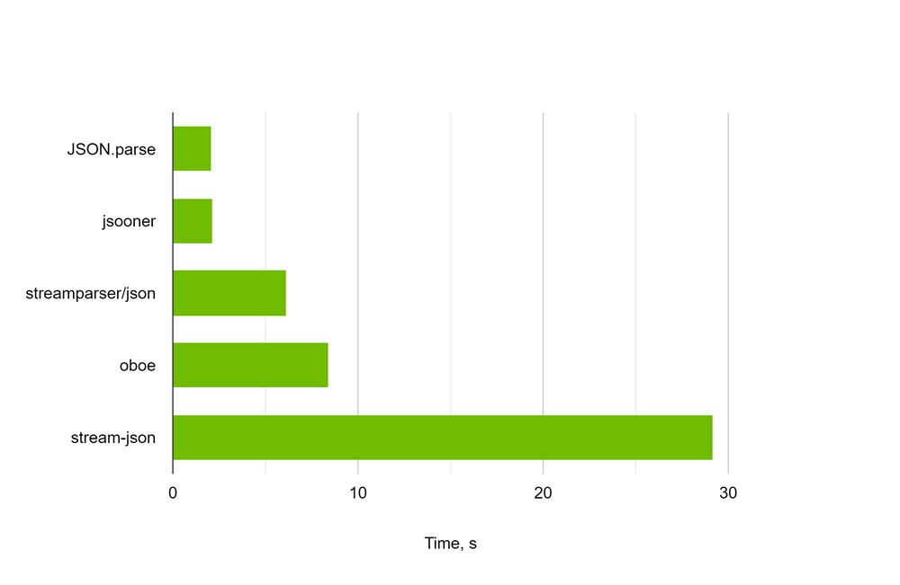
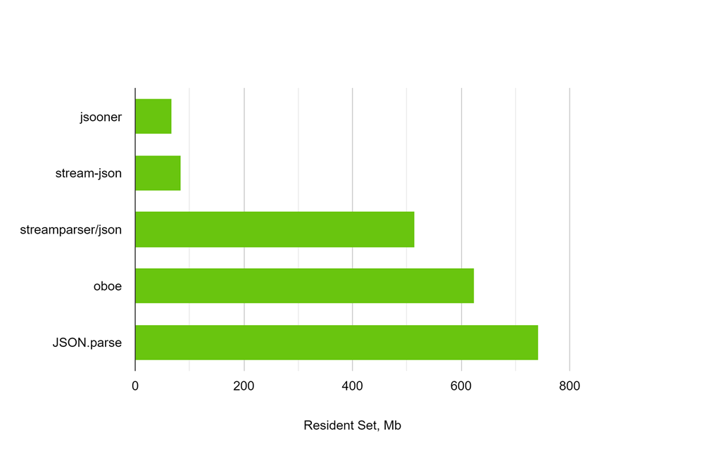

# jsooner

[](https://www.npmjs.com/package/jsooner)

[](https://bundlephobia.com/package/jsooner)

`jsooner` is a lightweight, efficient library for parsing large JSON streams.

It’s specifically designed for handling long sequences of JSON objects in a fast and memory-efficient way, without aiming to be a full-featured JSON parser.

## Why jsooner?

Parsing large JSON files or continuous streams can overwhelm standard methods like `JSON.parse`, especially in terms of memory and speed. `jsooner` addresses these challenges with:

- _Efficiency:_ Parses JSON incrementally as data arrives, outperforming `JSON.parse` on streams.
- _Memory Optimization:_ Handles streaming data with minimal memory usage

## Installation

You can install `jsooner` via npm:

```bash
npm install jsooner
```

## Usage

Here's a basic example of how to use `jsooner`:

```TypeScript
import { toJsonAsyncIterable } from "jsooner";

const response = await fetch("https://raw.githubusercontent.com/vnau/jsooner/refs/heads/main/examples/data/point-samples.geojson");
const features = toJsonAsyncIterable(response, { lookup: '"features"' });
for await (const feature of features) {
    console.log(feature);
}
```

## Performance

`jsooner` has been benchmarked against other JavaScript parsers that support streaming, as well as the native `JSON.parse` method, to demonstrate its efficiency with large JSON files.

The benchmarks were conducted on a [136 MB GeoJSON file](https://data-nces.opendata.arcgis.com/api/download/v1/items/6a4fa1b0434e4688b5d60c2e5c1dcaaa/geojson?layers=0) stored locally.

### Parsing Time



### Parsing Memory



## License

This project is licensed under the MIT License. See the [LICENSE](LICENSE) file for details.
